# Node.js 入门

创建文件夹 **01-node-demo**


## 1. Hello World

① 新建一个 **hello-world.js**，输入如下代码：

```js
console.log("Hello World!")
```

② 打开 cmd

进入到程序所在目录，输入

```bash
node ./hello-world.js
```

然后就可以看到执行结果了！


## 2. 文件读取

① 新建一个 file.txt，放入数据

```json
{
    "name" : "frankeleyn",
    "age" : 21
}
```

② 创建 **02-read-file.js**

```js
// 引入文件库
const fs = require('fs')

// 读取文件
fs.readFile("./file.txt", (err, data) => {
    if(err) {
        console.log(err);
        return;
    }
    // 打印文件中的数据
    console.log(data.toString());
})
```

③ 运行

```bash
node ./read-file-02.js
```


## 3. 服务器端介绍

① 创建 **03-node-server.js**

```js
// 引入 http 库
const http = require('http')

// 创建一个 http 服务
http.createServer((req, res) => {
    console.log("访问我的 http 服务器")

    // 设置响应状态码和响应头
    res.writeHead(200,{'content-type' : 'text/html'})
    res.end('<h1>Hello Node Server</h1>')

}).listen(8088)
```

② 运行：

```bash
node ./node-server-03.js
```


之后可以打开浏览器，输入 **localhost:8088**，就能看到结果


# ECMAScript 6


## 一、介绍

**ECMA**（European Computer Manufacturers Association）中文名称为欧洲计算机制造商协会，这个组织的目标是评估、开发和认可电信和计算机标准。1994 年后该组织改名为 Ecma 国际。

**ECMAScript** 是由 Ecma 国际通过 ECMA-262 标准化的脚本程序设计语言，而 **ECMAScript 6** 简称 **ES6**。

ES6 和 后端的 Java8 的概念类似。


## 二、基本语法

创建文件夹 **02-es6-demo**


### 1. let 声明变量

let 和 var 的区别体现在作用域上。var 的作用域被规定为一个函数作用域，而 let 则被规定为块作用域，块作用域要比函数作用域小一些，但是如果两者既没在函数中，也没在块作用域中定义，那么两者都属于全局作用域。

他两的用法则是相同的，var 怎么使用，let 就怎么使用。


创建 **01-let.js**

```js
// 声明变量
let a
let b,c,d
let e = 1
let f = 2, g = 'abc', h = [], i = {}

// 域的作用
{
    var star = 3
    console.log(star);
}
// console.log(star); 报错, star not defined


// console.log(song); 报错: cannot access before initialization
let song = 'Hey Jude'
console.log(song);
```


### 2. const声明常量

创建 **02-const.js**

```js
// 声明常量
const SCHOOL = '清华'
console.log(SCHOOL);

// 报错，常量不允许修改，下面这段会报错
SCHOOL = '北大'
console.log(SCHOOL);

// 报错，常量必须给初始值
const A;

// 常量变量不能改，但常量指向的对象和数组可以改，因为内存地址没变更
// 如果重新指向内存地址就会报错，比如： TEAM = ['IG', 'FPX']
const TEAM = ['RNG', 'WE', 'EDG']
console.log(TEAM);
TEAM.push('TOP')
console.log(TEAM);
```


### 3. 模板字符串

创建 **03-temStr.js**

模板字符串相当于加强版的字符串，用反引号 `，除了作为普通字符串，还可以用来定义多行字符串，还可以在字符串中加入变量和表达式。

```js
// 变量拼接
let name = '撒贝宁'

let find = `${name}真帅`

console.log(find);
```


### 4. 箭头函数

创建 **04-fun.js**

函数式编程，和 java 中的 lambda 差不多

```java
// 函数a
let a = function(n) {
    return n + 100;
}
console.log(a(1));

// 用箭头函数简写 函数a
let b = n => n + 100;
console.log(b(2));
```


### 5. Promise

创建 **05-promise.js**

Promise 是ES6 引入的异步编程的新解决方案。语法上 Promise 是一个构造函数， 用来封装异步操作并可以获取其成功或失败的结果。

```js
// 用 promise 异步读取 file.txt
const { rejects } = require('assert')
const fs = require('fs')

// 实例化 Promise 对象：
// Promise对象有三个状态：初始化、成功、失败
const p = new Promise((resolve, rejects) => {
    fs.readFile('../file.txt', (err, data) => {
        // 当文件读取失败时，reject将Promise对象的状态设置为失败，获取 err 的信息
        if (err) 
            reject(err)
        
        // 读取成功
        resolve(data)
    })
})

p.then(res => {
    // 打印成功信息
    console.log(res.toString());
}).catch(error => {
    // 打印错误信息
    console.log(error.toString());
})
```


# Axios


## 一、Axios 入门


### 1. Axios 的 作用

[Axios](http://www.axios-js.com) 是一个基于 promise 的 HTTP 库，可以用在浏览器和 node.js 中。


### 2. 入门案例

##### ① 添加后端接口

自己建一个可以返回 json 数据的 SpringBoot 项目，指定端口号和地址。

比如，我的地址是：http://localhost:8082/user/list

##### ② 创建文件夹

创建 **03-axios-demo** 文件夹

##### ③ 引入 axios.js

将 **axios.js** 引入 **03-axios-demo** 文件夹

##### ④ 测试

创建 **index.html**

```html
<!DOCTYPE html>
<html lang="en">
<head>
    <meta charset="UTF-8">
    <meta http-equiv="X-UA-Compatible" content="IE=edge">
    <meta name="viewport" content="width=device-width, initial-scale=1.0">
    <title>axios 案例</title>
    <script src="axios.js"></script>
</head>
<body>
    <h1>Axios 案例</h1>
</body>

<script>
    // 普通写法
    axios({
        method: 'get',
        url: 'http://localhost:8082/user/list',
    })
    .then((response) => {
        console.log('获取数据成功', response)
    })
    .catch((error) => {
        console.log('获取数据失败', error)
    })

    // ES6 写法
    axios.get('http://localhost:8082/user/list')
         .then(res => {
            console.log('获取数据成功：' + res);
         })
         .catch(error => {
            console.log('获取数据失败：' + error);
         })
</script>
</html>
```

##### ⑤ 运行

使用 **Open with Live Server**  运行(需要安装 Live Server 插件)，这样使用的就是 node 服务器运行的前端项目。

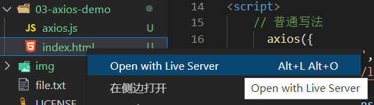

运行之后你就发现，报错了，因为没有**设置跨域** (下文介绍跨域)

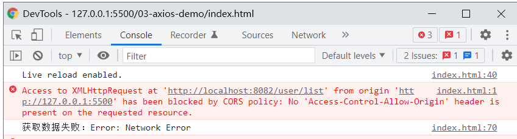


## 二、跨域


###  1. 为什么出现跨域

**跨域** 是因为浏览器的**同源策略**限制所导致的。

**同源**（即指在同一个域）就是两个地址具有相同的协议（protocol）、主机（host）和端口号（port）

以下情况都属于跨域：

| **跨域原因** | **示例**                       |
| :----------- | ------------------------------ |
| 域名不同     | jd.com 和 taobao.com   |
| 端口不同     | www.qq.com:81 和 www.qq.com:82 |

http和https也属于跨域。

**同源策略会阻止一个域的 javascript 脚本和另外一个域的内容进行交互**。

我们是从 localhost:5500 端口去访问 localhost:8082 端口，这属于端口不同，跨域了。


### 2. 解决跨域

① JsonP，利用 js 标签的一个漏洞

② Nginx 反向代理，请求转发，将不跨域的请求转发到跨域请求上

③ Cors, Http 允许跨域

在后台的 controller上添加一个注解 **@CrossOrigin** 就可以了。


## 三、自定义配置


### 1、配置axios实例

可以对axios进行配置，简化代码的编写

```js
// 创建一个 axios 对象
const request = axios.create({
    baseURL: 'http://localhost:8082', //url前缀
    timeout: 1000, //超时时间
    headers: {'jsessionid': 'frankeleyn'}
})
```


### 2. 配置请求参数

远程接口的url地址可以修改成相对路径了

```js
// 发送 axios 请求
request({
    method:'get',
    url:'/user/list'
}).then(response => {
    console.log('获取数据成功', response.data[0].name)
}).catch(error => {
    console.log('获取数据失败', error)
})

// es6 写法
request.get('/user/list')
    .then(res => console.log('获取数据成功：' + res.data[1].name))
    .catch(error => console.log('获取数据失败：' + error))
```


## 四、拦截器

在请求或响应被 then 或 catch 处理前拦截他们。

在前后端分离的项目中，Session 是不共享的，于是我们就需要在请求到达之前 或 响应之后，拦截请求做一些操作。


### 1. 请求拦截器

在发送axios请求前，可以拦截请求，对请求做一些处理

```js
// 开启请求拦截器
request.interceptors.request.use(
  (config) => {
    // 正常的请求
    config.headers.token = "user-frankeleyn"
    return config
  },
  (error) => {
    // 错误的请求
    return Promise.reject(error)
  }
)
```

发送请求时，就会携带这个你自定义的 token

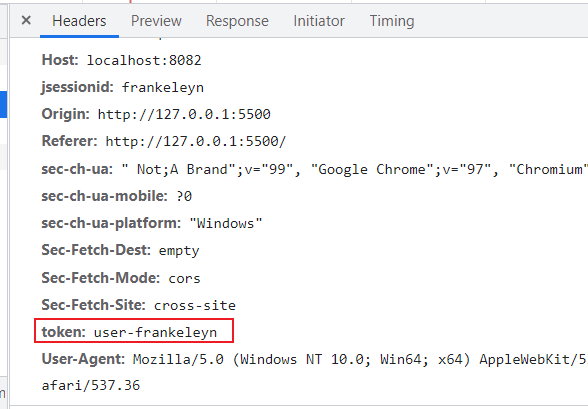


### 2. 响应拦截器

在发送完请求，获取到响应后，可以对响应做一些处理，再返回给前端用户

```js
// 返回结果拦截器
request.interceptors.response.use(
  (response) => {
    console.log('返回结果拦截', response);
    return response.data
  },
  (error) => {
    return Promise.reject(error)
  }
)
```


# 模块化


## 一、简介

js 的模块化就像封装 java 框架一样，在 js 封装的过程叫 **模块化**。


### 1. 案例

① 创建 **04-module-demo** 目录，创建 **no-module** 目录，创建 **a.js**

```js
let name = '奥巴马'
```

② 创建 **b.js**

```js
let name = '暴暴'
```

③ 创建 **demo.html**

从这个例子可以看出，**name** 的值的不确定性很大，a和b两个 js 文件中的同名变量互相干扰。

```html
<!DOCTYPE html>
<html lang="en">
<head>
    <meta charset="UTF-8">
    <meta http-equiv="X-UA-Compatible" content="IE=edge">
    <meta name="viewport" content="width=device-width, initial-scale=1.0">
    <title>Document</title>
    <script src='a.js'></script>
    <script src='b.js'></script>
</head>
<body>
    
</body>
<script>
    console.log(name);
</script>
</html>
```


## 二、模块化规范


### 1. 导出模块

创建 **module** 目录，创建 **m1.js**

```js
export let name = '亚索'

export function r() {
    console.log("狂风绝息斩");
}
```

创建 **m2.js**

```js
export let name = '永恩'

export function r() {
    console.log('封尘绝念斩');
}

// 或者这样导出
export let name = '永恩'

export function r() {
    console.log('封尘绝念斩');
}
export {star, sing}
```


### 2. 导入模块

创建 **demo.html**

```html
<body>
    <h1>模块化测试</h1>
</body>
<script type='module'>
    import * as m1 from './m1.js'
    import * as m2 from './m2.js'

    console.log(m1.name);
    m1.r()

    console.log(m2.name);
    m2.r()
    
    //还可以这样导入：解构赋值的形式
    import {name, r} from './m1.js'
    import {name as name2} from './m2.js' //使用as防止重名
    console.log(name)
    r()
    console.log(name2)
</script>
```


## 三、默认暴露模块

### 1. 默认暴露

创建 **m3.js**

```js
export default{
    username : '奥巴马',
    age : 25,
    r() {
        console.log("圣枪洗礼");
    }
}
```


### 2. 导入模块

在 **demo.html** 中导入模块

```js
//导入m3
import m3 from './m3.js'
console.log(m3)
```


## 四、封装代码

### 1. 创建 app.js

```js
import * as m1 from './m1.js'
import * as m2 from './m2.js'
import m3 from './m3.js'

m1.r()
m2.r()
m3.r()
```


### 2. 引入 app.js

创建 **demo-app.html**，引入 **app.js**

```html
<!DOCTYPE html>
<html lang="en">
<head>
    <meta charset="UTF-8">
    <meta http-equiv="X-UA-Compatible" content="IE=edge">
    <meta name="viewport" content="width=device-width, initial-scale=1.0">
    <title>Document</title>
    <script src='m1.js'></script>
    <script src='m2.js'></script>
</head>
<body>
    <h1>模块化测试</h1>
</body>
<script type='module' src='./app.js'>
</script>
</html>
```

运行结果：

```tex
狂风绝息斩
封尘绝念斩
圣枪洗礼
```


# Vue


## 一、 简介

[Vue](https://cn.vuejs.org/) 是一套用于构建用户界面的**渐进式框架**。与其它大型框架不同的是，Vue 被设计为可以自底向上逐层应用。


##  二、起步

创建文件夹 **05-vue**，复制 **vue.js**，创建 **01-hello.html**


### 1. 引入脚本

去网上下载一个 **vue.js**，放入 **05-vue** 目录下，引入

```js
<script src="vue.js"></script>
```

### 2. 数据绑定

```html
<!DOCTYPE html>
<html lang="en">
<head>
    <meta charset="UTF-8">
    <meta http-equiv="X-UA-Compatible" content="IE=edge">
    <meta name="viewport" content="width=device-width, initial-scale=1.0">
    <title>hello</title>
    <script src="vue.js"></script>
</head>
<body>
    <div id="app">
        <!-- 插值表达式，绑定 vue 中的 data 数据 -->
        {{message}}
    </div>
</body>
<script>
    new Vue({
        // 选择器，选定绑定范围
        el : '#app',
        data : {
            // 注册一个数据对象，用于视图中的数据绑定
            "message" : "Hello Vue"
        }
    })
</script>
</html>
```

**声明式渲染：**Vue.js 的核心是一个允许采用简洁的模板语法来声明式地将数据渲染进 DOM 的系统

```json
data: {
    message: 'Hello Vue!'
}
```


## 三、数据绑定


### 1. 单向绑定

**① **创建 **02-bind.html**

**② **引入脚本，创建 Vue 对象

```html
<script src="vue.js"></script>
<script>
    new Vue({
    el: '#app',
    data: {
        company: '尚硅谷',
        site: 'http://www.atguigu.com'
    }
})
</script>
```

**③ ** 使用数据绑定渲染

```html
<div id="app">
    <a v-bind:href="site" target="_blank">{{company}}</a>
    <input type="text" v-bind:value="company">
</div>
```

**v-bind** 简写：

```html
<div id="app">
    <a :href="site" target="_blank">{{company}}</a>
    <input type="text" :value="company">
</div>
```

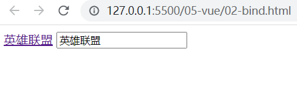


### 2. 双向绑定

**① **创建 **03-model.html**

**② ** 复制 02 的代码重命名为 03

**③ ** 将 **v-bind:value** 改为 **v-model**

```html
<div id="app">
    <a :href="site" target="_blank">{{company}}</a>
    <input type="text" v-model="company">
</div>
```

双向数据绑定的作用

- 当数据发生变化的时候，视图也会跟着发生变化

  数据模型发生了改变，会直接显示在页面上

- 当视图发生变化的时候，数据也会跟着同步变化

  用户在页面上的修改，会自动同步到数据模型中去

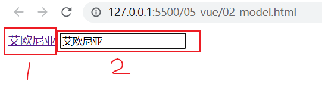

当我在 2 的文本框修改值的时候，1 也会变成和 2 一样的值，而单向绑定就不会有这个效果。


## 四、绑定事件监听

创建 **04-event.html**

使用 **v-on** 进行事件绑定，**v-on:click** 表示处理鼠标点击事件，事件调用的方法定义在 vue 对象声明的 **methods** 节点中

```html
<body>
    <div id="app">
        <button v-on:click="play">玩游戏</button>
    </div>
</body>
<script src="vue.js"></script>
<script>
    new Vue({
        el : "#app",
        data : {
            game : "英雄联盟"
        },
        methods: {
            play() {
                alert('我要玩 ' + this.game)
            }
        }
    })
</script>
```

v-on 指令的可简写：

```html
<button @click="play">玩游戏</button>
```

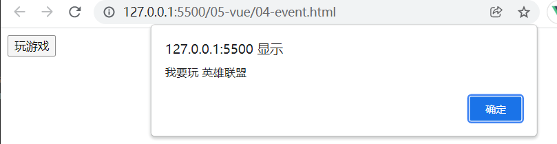


## 五、计算属性

在实现具体值的时候对该值需要计算的属性叫做 **计算属性**。

创建 **05-calcul.html**

### 1. 模板中使用 js 表达式

```html
<body>
    <div id="app">
        <p>原始值：{{message}}</p>

        <p>反转：{{message.split('').reverse().join('')}}</p>
    </div>
</body>
<script src="vue.js"></script>
<script>
    new Vue({
        el : "#app",
        data : {
           "message" : "hello"
        }
    })
</script>
```

模板表达式非常便利，但是设计它们的初衷是用于简单运算的，复杂的逻辑不太适合放在这里，这时候就需要用到 **计算属性**。


### 2. 计算属性

计算属性，就是**有计算方法的属性**。

```html
<body>
    <div id="app">
        <p>原始值：{{message}}</p>

        <p>反转：{{reversedMessage}}</p>
    </div>
</body>
<script src="vue.js"></script>
<script>
    new Vue({
        el : "#app",
        data : {
           "message" : "hello"
        },
        computed: {
            reversedMessage () {
                console.log('计算属性')
                return this.message.split('').reverse().join('')
            }
        }
    })
</script>
```


### 3. 使用方法

```json
methods:{
    reversed () {
        console.log('方法执行')
        return this.message.split('').reverse().join('')
    }
}
```

```html
<!-- 调用方法 -->
<p>反转：{{reversed()}}</p>
```


### 计算属性和方法的区别

- ##### 计算属性基于缓存

- ##### 方法总会再次执行

普通方法是一个操作手册，相当于一个说明书

计算属性是针对内存的一次运算，是内存结果出现之前所插入的一段代码

```html
<!-- 2、使用计算属性 -->
<p>反转消息: {{ reversedMessage }}</p>
<!-- 调用两次只执行一次属性的计算 -->
<p>反转消息: {{ reversedMessage }}</p>

<!-- 3、使用方法 -->
<p>反转消息: {{ reversed() }}</p>
<!-- 调用两次执行了两次属性的计算 -->
<p>反转消息: {{ reversed() }}</p>
```


### 计算属性的案例

创建 **06-full-name.html**

```html
<body>
    <div id="app">
        姓: <input placeholder="First Name" v-model="firstName" /><br />
        名: <input placeholder="Last Name" v-model="lastName" /><br />
        姓名1(单向): <input placeholder="Full Name1" v-model="fullName1" /><br />
        姓名2(双向): <input placeholder="Full Name2" v-model="fullName2" /><br />
    </div>
</body>
<script src='vue.js'></script>
<script>
    new Vue({
        el : '#app',
        data : {
            "firstName" : "Benjamin",
            "lastName" : "Franklin"
        },
        computed: {
            fullName1() {
                console.log('计算 fullName1');
                return this.firstName + this.lastName
            },

            fullName2: {
                get() {
                        console.log('计算fullName2')
                        return this.firstName + ' ' + this.lastName
                },
                
                set(value) {
                    console.log('fullName2 的 setter')
                    const names = value.split(' ')
                    this.firstName = names[0]
                    this.lastName = names[1]
                }
            }
        }
    })
</script>
```

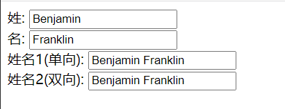


## 六、条件渲染

创建 **07-if.html**

点击复选框，显示或隐藏协议内容。分别使用 **v-if** 和 **v-show** 实现

```html
<body>
    <div id="app">
        <input type="checkbox" v-model="status"><br>
        <!-- v-if 实现 -->
        <p v-if="status">显示</p>
        <p v-else>不显示</p>

        <!-- v-show 实现 -->
        <p v-show="status">显示</p>
        <p v-show="!status">不显示</p>
    </div>
</body>
<script src="vue.js"></script>
<script>
    new Vue({
        el : "#app",
        data : {
            "status" : false
        }
    })
</script>
```

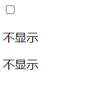

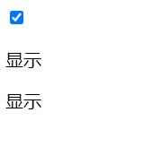


## 七、列表渲染

创建 **08-for.html**

```html
<body>
    <div id="app">
        <ul>
            <li v-for="(item, index) in users">
                {{index + 1}}   姓名: {{item.name}}  年龄: {{item.age}}   技能: {{item.skill}}
            </li>
        </ul>
    </div>
</body>
<script src="vue.js"></script>
<script>
    new Vue({
        el : "#app",
        data : {
            users : [
                {name : "亚索", age : 28, skill : "狂风绝息斩"},
                {name : "永恩", age : 29, skill : "封尘绝念斩"}
            ]
        }
    })
</script>
```

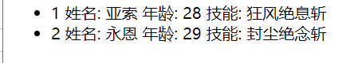


## 八、生命周期

创建 **09-period.html**

```html
<body>
    <div id="app">
        <h2 id="h2">{{message}}</h2>
    </div>
</body>
<script src="vue.js"></script>
<script>
    new Vue({
        el : "#app",
        data : {
            "message" : "谦逊薄弱，就是见识薄弱"
        },
        methods: {
            show() {
                console.log("show() 函数被调用");
            }
        },
        created() {
            console.log("created 钩子函数调用");
            // 可以操作 data 中的数据
            console.log(this.message);
            // 可以调用 methods 中的方法
            this.show(); 
            // 但是获取不了 dom 节点，因为此时 vue 还没开始渲染        
            console.log("获取 dom " + document.getElementById("h2").innerText);
        },
        mounted() {
            console.log("mounted 钩子函数被调用");
            // 此时 vue 已经渲染好了数据，可以获取 dom 节点
            console.log("获取 dom " + document.getElementById("h2").innerText);
        }
    })
</script>
```

执行结果：
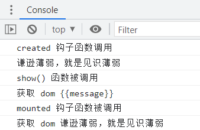


# Vue UI 组件库


## 一、常见组件库


### 1、Mint UI

主页：http://mint-ui.github.io/#!/zh-cn

说明：饿了么开源的基于Vue的移动端UI组件库


### 2、Element-UI

主页：http://element-cn.eleme.io/#/zh-CN

说明：饿了么开源的基于Vue的PC端UI组件库


## 二、Element-UI 案例

创建文件夹 **06-ui**，创建 **01-demo.html**


### 1. 引入脚本

```html
    <script src="vue.js"></script>
    <script src="axios.js"></script>
    <!-- 引入样式 -->
    <link rel="stylesheet" href="https://unpkg.com/element-ui/lib/theme-chalk/index.css" />
    <!-- 引入组件库 -->
    <script src="https://unpkg.com/element-ui/lib/index.js"></script>
```


## 2. 渲染数据

```html
<body>
    <div id="app">
        <el-table :data="users" stripe border style="width: 100%" >
                <el-table-column prop="name" label="姓名"></el-table-column>
                <el-table-column prop="age" label="年龄"></el-table-column>
                <el-table-column prop="skill" label="技能"></el-table-column>
        </el-table>
    </div>
</body>
<script>
    new Vue({
        el: "#app",
        data: {
            users: [
                { name: "亚索", age: 28, skill: "狂风绝息斩" },
                { name: "永恩", age: 29, skill: "封尘绝念斩" }
            ]
        }
    })
</script>
```


运行结果：

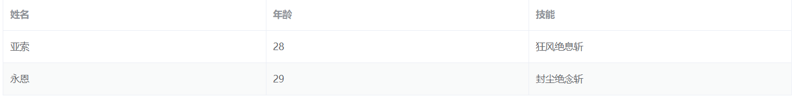


# Vue-Router


## 一、介绍

Vue.js 路由允许我们通过锚点定义不同的 URL， 达到访问不同的页面的目的，每个页面的内容通过延迟加载渲染出来。

通过 Vue.js 可以实现多视图的**单页Web应用**（single page web application，SPA）


## 二、路由案例


### 1. 创建文件夹和文件

创建文件夹 **07-router**，创建 **index.html**


### 2. 引入 js

```html
<script src="vue.js"></script>
<script src="vue-router.js"></script>
```


### 3. 编写 html

```html
<body>
    <div id="app">
        <h1>Hello Vue Router!</h1>
        <p>
            <!-- <router-link> 默认会被渲染成一个 `<a>` 标签 -->
            <!-- 通过传入 `to` 属性指定链接. -->
            <router-link to="/">首页</router-link>
            <router-link to="/equip">装备列表</router-link>
            <router-link to="/heor">英雄列表</router-link>
        </p>
        <!-- 路由出口 -->
        <!-- 路由匹配到的组件将渲染在这里 -->
        <router-view></router-view>
    </div>
</body>
```


### 4. 编写 js

```html
<script>
    // 1. 定义路由组件
    const welcome = { template: "<div>英雄联盟首页</div>" }
    const equip = { template: "<div>装备列表<div>" }
    const hero = {template: "<div>英雄列表</div>" }

    // 2. 定义路由集合
    const routes = [
        { path: '/', redirect: '/welcome' }, // 默认的欢迎页面
        { path: '/welcome', component: welcome },
        { path: '/equip', component: equip },
        { path: '/hero', component: hero }
    ]

    // 3. 创建 router 实例，传入组件
    const router = new VueRouter({
        routes // 缩写，相当于 routes: routes
    })

    // 4. 加载 vue-router
    new Vue({
        el: "#app",
        data: {},
        router
    })
</script>
```

显示结果：

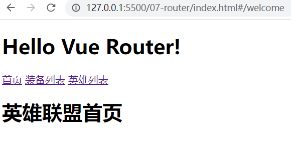
